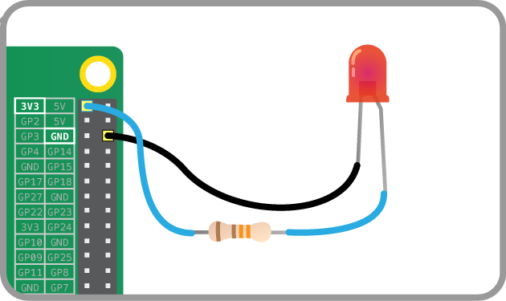

## Lighting an LED

Try connecting an LED to the Pi's 3V3 and GND pins with a resistor:

The LED should light up. It will always be on, because it's connected to a 3V3 pin.

Now try moving it from 3V3 to GPIO pin 17:

The LED should now turn off, but now it's on a GPIO pin, and can therefore be controlled by code.

