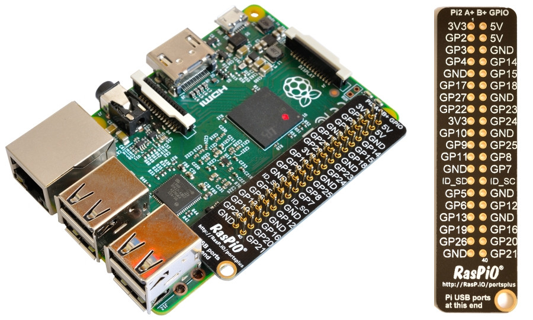

## Pins GPIO 

Al conjunto de pines que se encuentran a un lado de la Raspberry Pi se les llama pins GPIO (General-Purpose Input/Output) o Entradas y Salidas de Propósito General.

Estos pines permiten a la Raspberry controlar cosas en el mundo real. Puedes conectar componentes electrónicos a estos pines: estos componentes pueden ser de salida, como los LEDs (Diodos Emisores de Luz) que se pueden encender y apagar a voluntad, o componentes de entrada, como un botón o un sensor que puedes usar para disparar otros eventos. Por ejemplo, puedes encender un LED cada vez que detectes que un botón ha sido pulsado. 

Con la librería GPIO Zero, podrás controlar los pins GPIO de la Raspberry de manera sencilla. Hay 40 pins en la Raspberry Pi (26 en los modelos más antiguos) que permiten diferentes funciones.

La etiqueta de identificación RasPIO puede ayudarte a identificar cuál es el uso de cada pin. Asegúrate de que la etiqueta está colocada de manera que el pequeño agujero quede al lado de los puertos USB, ligeramente hacia afuera de la placa.

Si no tienes una etiqueta, esta guía puede ayudarte a identificar el número de cada pin.

Verás que hay pins que están marcados con 3V3, 5V, GND y GP2, GP3, etc:
|     |     |     |
| --- | --- | --- |
|3V3|3.3 voltios|Cualquier cosa que conectes a estos pins recibirá un voltaje de 3.3V|
|5V|5 voltios|Cualquier cosa que conectes a estos pins recibirá un voltaje de 5V|
|GND|Tierra|Tierra o cero voltios, usado para cerrar el circuito.|
|GP2|GPIO pin 2|Estos pines son de propósito general y se pueden configurar como entrada o como salida
|ID_SC/ID_SD/DNC|Pins de propósito especial|

