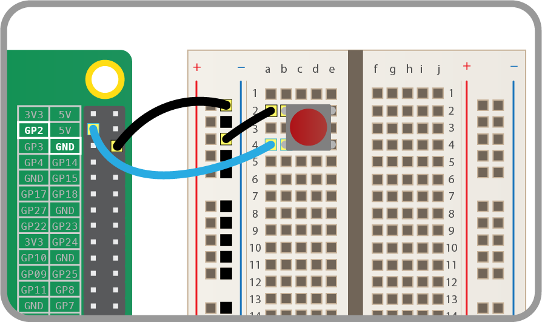

## Using buttons to get input

Now you are able to control an output component - an LED, let's connect and control an input component - a button. 

- Connect a button to another GND pin and GPIO pin 2 like this:

    

- Create a new file by clicking **File > New file**.

- Save the new file by clicking **File > Save**.

- Save the file as `gpio_button.py`.

- This time you'll need the Button class, and to tell it that the button is on pin 2. Write the following code in your new file:

	```python
	from gpiozero import Button
	button = Button(2)
	```

- Now you can get your program to do something when the button is pushed. Add these lines:

	```python
	button.wait_for_press()
	print('You pushed me')
	```
- Save with **Ctrl + S** and run the code with **F5**. 
- Press the button for your text to appear. 

